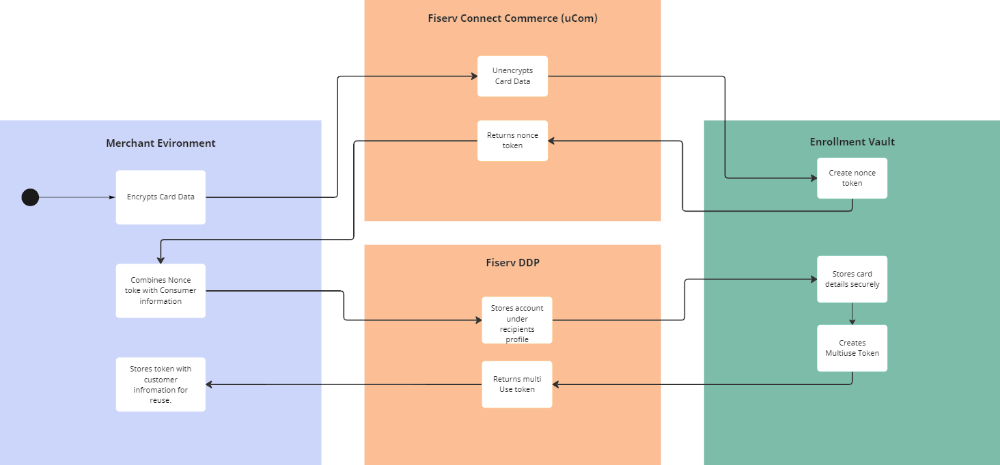

# Tokens FAQ

## What is a Token?

Tokenization is a form of data substitution it uses randomly generated numbers in place of account number. This differs from encryption in that tokens have no direct relationship with the data they replace. Tokens are either universal or merchant-specific and are account-based, meaning a merchant will always get the same token back for a specific account number.

## As a Merchant, what are the benefits of using Tokens?

- Reduces the costs associated with PCI compliance in three ways:
  - Shrinks the vendors card-data environment (CDE)
  - Simplifies the questionnaire that the vendors customers must answer
  - Changes the answers of some questions to N/A
- Removes the risk of storing card data, transferring it to the processor
- Allows the vendor to focus on projects that contribute to revenue rather than securing cardholder data

## What Type of Token does DDP use?

DDP allows two types of tokens to be used with the platform: Enrollment Vault and TransArmor. They are both great solutions and will depend on the merchant's use case for which one is the best fit.

### Enrollment Vault (EV) Token

Enrollment Vault is Fiserv's internal secure storage solution to card and account security. It is a reusable proprietary token that secures the primary account number by replacing it with a token to be stored in the merchant’s system. The card details can either be entered directly into Fiserv's vault through the recipient portal or a Hosted Page solution. If the merchant would rather capture this data a public encryption key can be used to capture the data, encrypt it, and send it to Fiserv's vault using only Fiserv API access as seen below. The merchant can then use this token in place of the account number to initiate multiple payment request without requesting a new token.

#### How Does EnrollmentVault work?

1. Consumer presents card to merchant.
2. Card data is encrypted and transmitted to Connected Commerce (uCom) token service.
3. Connect Commerce (uCom) returns a one-time use nonce token.
4. Merchant passes nonce token and consumer's information to DDP.
5. Nonce token and consumer information is sent to Enrollment Vault.
6. Enrollment Vault stores consumer information with account and tokenize the account.
7. Token returned to DDP.
8. DDP Returns Token to the merchant
9. Merchant stores token instead of card data in their environment and uses the token for all subsequent business processes.



> ##### *This flow gives a high-level overview of how to retrieve an EV token through DDP's API flow. For a more in-depth explanation you can click [here](../interactive-guide/apiflow.md) to review our API implementation guide.*

___

#### What is the process/Algorithm used in encrypting data in the Enrollment Vault?

Vault stores two main types of information, customer, and instrument. Customer information is information relating to an actual person who is a user of the application. Instruments refer to payment and loyalty instruments and accounts, such as credit cards, ACH accounts, PayPal tokens etc.

In both cases records are stored in two parts, secure and meta. Meta data is data that does not contain PCI or PII data and does not require encryption before storage. This can include non-identifying PII such as country etc. that does not need to be stored securely. Secure data is data that does contain PII or PCI data and does require encryption. To store data in the vault the data is first converted into a Vault record which contains a secure and meta section. The secure data is encrypted using Voltage encryption which encrypts the entire secure section. Then the entire record is stored in the data store.

To access or store data in the vault a calling application (in this case, DDP) first needs to acquire authentication token. The authentication token contains both the calling application identifier and the actual client that the data is stored for. This token is valid for 5 minutes and allows access to any records associated with the application and client that the token is generated for. On data retrieval the token is decoded, and the calling application and client is identified. Data can only be retrieved by the same calling application with a valid token for the matching client information.

### TransArmor (TA) Token

TransArmor is a dual-layered payment card security solution that combines strong encryption and tokenization technology. TransArmor secures the transaction from the moment of swipe – prior to transmission and throughout the payment process with encryption, and it prevents card data from entering the merchant’s card data environment (CDE) by replacing the primary account number (PAN) with a random-number token that can be safely stored.

#### How does TransArmor Work?

1. Consumer presents card to merchant.
2. Card Data is encrypted and transmitted to First Data front-end.
3. First Data front-end decrypts the data payload.
4. Card data is sent to issuing bank for authorization and in parallel, tokenized.
5. Token is paired with authorization response and sent back to the merchant.
6. Merchant stores token instead of card data in their environment and uses the token for all subsequent business processes.


#### What Encryption Methods are Used in TransArmor

There are four available encryption methods used in TransArmor: Three are Symmetric (shared key), and one is Asymmetric (public key). We will discuss the Asymmetric method as it is most applicable for DDP.

RSA/PKI: Asymmetric Key – Non-Format Preserving Encryption (Non-FPE)

- Uses the RSA 2048-bit algorithm.
- Public Key resides on merchant device.
- Private Key resides within First Data datacenter.
- Supports mag-stripe, RFID, smart-card, and manual entry.
- Non-FPE data does not resemble original target data.

```no-highlight
PAN 4356887600331588 = qdjOJd1&22jlaowiAiwdj(*882sSkw9lkwxMj2@j2jjPxw8*nHg1#2134nnuwNxdwKLwO
```

> ##### More in-depth information on TransArmor can be found on the TransArmor [Introduction Document](https://merchants.fiserv.com/content/dam/s7/firstdata/us/en/article_listing/301-654-transarmor_ss_2p.pdf) or in the [FAQ Document](https://merchants.fiserv.com/content/dam/s7/firstdata/us/en/article_listing/TransArmor_FAQ_Transitional.pdf)
